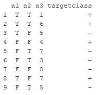

<i>
You are required to submit both Markdown and PDF files. Data set (Spam E-mail Data) relevant for this assignment can be found in the R package "DAAG". 
</i>

```{r setup, include=FALSE}
knitr::opts_chunk$set(echo = TRUE)
library(ggplot2)
library(DAAG)
library(rpart)
library(rpart.plot)
library(rattle)
library(dplyr)
library(caret)
```

----------------------------------------
Problem 1 (2 pt.)

Consider the training examples shown in the table for a binary classification problem: <br>


<p>
a.  What is the best split (between a1 and a2) according to the classification error rate? Show calculations in R.
b. What is the best split (between a1 and a2) according to the Gini index? Show calculations in R. Which attribute would the decision tree algorithm choose? Why?
c. Why does not entropy start with 0?
d. Why DT is called a greedy algorithm?

----------------------------------------

Problem 2 (2 pt.)

a. Suppose the sysadmin wants to understand and predict the process of recognizing the emails as spam for new e-mails which make up 10% of your initial data. Use the full decision tree algorithm to solve this task. Show your tree and interpret the results. <br>
b. How many observations have your smallest node? Set the minimum number of observations in any terminal node 25% of the number of your initial data. Show the tree. Why do we need the arguments minbucket
and minsplit?<br>
c. Which are the advantages and disadvantages (at least 2 of each) of the DT algorithm? 


----------------------------------------


Problem 3 (3 pt.)

a. Make predictions based on both models.
b. Compare the models using the function confusionMatrix() and their results, ROC curve, and AUC. Which does perform better? Why? 
c. What is the difference between regression and classification trees (in terms of the loss function, prediction, and type of dependent variable)?


----------------------------------------
Bonus 1 (1 pt.)

Bring an example of a data set that cannot be partitioned effectively by a DT algorithm using test conditions involving only a single attribute. How can you overcome this difficulty?
 

Bonus 2 (1 pt.)

How to calculate the out-of-bag error rate.
What is the difference between out-of-bag error and test error in Random Forest?
