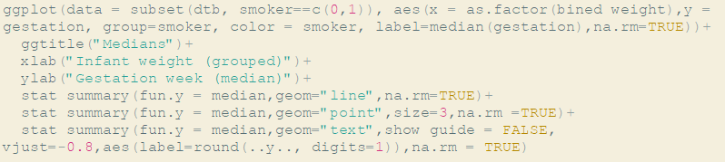

<h1>Homework 1<p>
Due date 01/03/2019 23:59
</h1>

<i>For this Homework, you are required to submit both Markdown and HTML files with your answers and the same codes in it.  Be sure that the file is working, so when I run it, there would be no errors. The homework will not be graded if the code fails to run. Write your code and interpretations under each question. The interpretations of the results need to be written below or above all the charts, summaries, or tables. Do not remove problems from your Markdown file. Use the library ggplot2 to solve these problems.</i>

<br>Use Dataset_1.csv dataset uploaded on GitHub (Repository: Homework) to analyze the relationship between characteristics of newborn babies and their parents. The description of the variables is given with a separate file. <p>
<b>Pay great attention to the names of axes, titles, and labels: convert 0-1 to yes-no, where it is appropriate. If you are not accurate with labeling you will lose the points. 
</b></br>


<b>Problem 1.(1 pt)</b>  Understand the structure of data. Clean the data if it is necessary: <p>
Load the file. <p>
You should use function str() or similar functions, to discover the dimension of your data, types of variables, the uselessness of some variables. <p>
Get rid of unnecessary variables.<p>
Check whether the data types are correct, if not make appropriate corrections assigning labels to each level according to the data description (set all categorical variables as factors). <p>
Make sure that you do not have missing values.<p>

```{r}

```


<b>Problem 2.	(2 pt)</b> a. Describe one numeric  variable and one categorical variable (choose your own variables). Use data visualization techniques.<p>
b. Consider grouped graphical comparisons for the chosen variables. Find outliers if they exist.<p>
c. Plot one histogram for a categorical variable. What is the difference between bar graph and histogram? <p>

```{r}

```

<b>Problem 3.	(1.5 pt)</b>  Describe the problem of overlapping and the way of solving it using this dataset. Show it using appropriate tools via R. Use data visualization techniques. <p>

```{r}

```

<b>Problem 4.	(2.5 pt)</b>  Use at least 3 variables for this task.<p>
a. Find the meaningful pattern between the 'weight of baby' and the other variables, add an element of descriptive statistics on graphics.<p>
b. Confirm your findings by computing correlation, visualize correlation by using the package ggcorrplot. Does any type of relationship exist among three variables if Pearson correlation coefficient is near 0? <p>
c. Make conclusions based on your findings.  
<p>
```{r}

```

<b> Bonus </b> (1 pt)	In order to find median values of the week of gestation by smoking and non-smoking mothers and grouped weight of infant I run the following code and faced some mistakes.

<p>Where did I go wrong? Show plot with mistakes as well.  (dtb is Dataset_1)
<p>
<b>Note:You should use both categorical and numeric variable for these tasks and different types of graphical representations: histogram, bar plot, scatter plot etc. Please, make brief and meaningful conclusions.</b> 
```{r}

```

